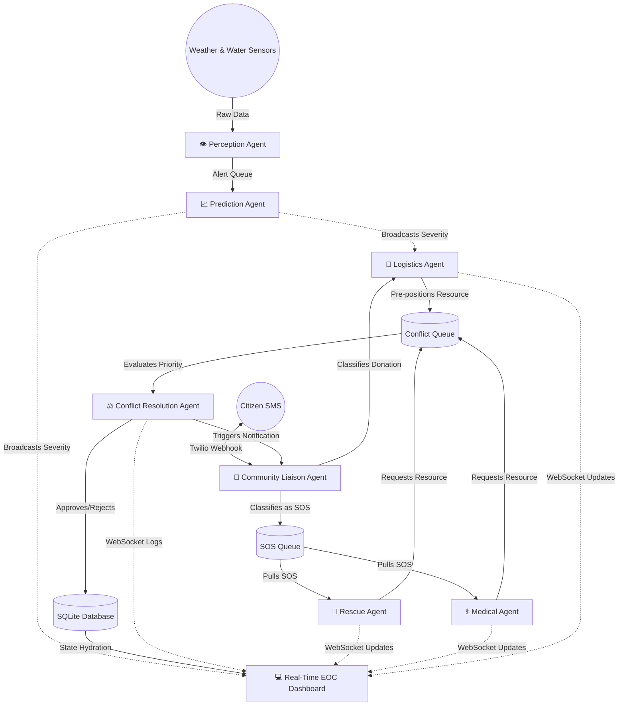

# 🌊 Flood Response Coordinator

**A 7-Agent Autonomous Flood Response System**

An advanced, multi-agent AI system designed to autonomously coordinate emergency response efforts during severe floods. Built with a focus on real-world applicability (specifically modeled after the Lakhimpur district in Assam), this system orchestrates rescue missions, medical dispatches, proactive logistics, and citizen communication using a network of intelligent agents that collaborate, debate, and resolve conflicts in real-time.

---

## ✨ Key Features

- **🧠 Multi-Agent Autonomous Coordination**: 7 specialized AI agents (Perception, Prediction, Rescue, Medical, Logistics, Liaison, and Conflict Resolution) that operate concurrently.
- **⚖️ Real-Time Conflict Resolution**: When multiple agents attempt to dispatch the same limited resource (e.g., a single helicopter for two different emergencies), a Priority Auction is held using a weighted formula (lives at risk, urgency, irreversibility, distance).
- **📱 Two-Way SMS Citizen Liaison**: Citizens can text the system via Twilio. The Liaison Agent uses NLP to classify the intent (SOS, Donation Offer, Shelter Request), handles multi-turn conversations, and automatically routes actionable intelligence to the correct queue.
- **🚚 Proactive Logistics & Donations**: The Logistics Agent preemptively moves trucks and boats based on flood predictions, and automatically assigns vehicles to pick up community donations.
- **🗺️ Live Mapbox Dashboard**: A React-based EOC (Emergency Operations Center) dashboard providing real-time visualization of flood severity, resource GPS tracking, SOS events, and live agent decision-making logs via WebSockets.
- **🔌 Offline / Fallback Mode**: Capable of running in a fully simulated offline mode with mock sensor data, ensuring the system remains operational if external network APIs drop.

---

## 🏗️ System Architecture & Agent Flow

The system does not operate in a simple linear pipeline. It is a highly dynamic, event-driven architecture where agents react to both environmental data and human input simultaneously.



### The 7 Agents
1. **👁️ Perception Agent**: Ingests raw environmental data (rainfall, river discharge) from external APIs or mock sensors.
2. **📈 Prediction Agent**: Calculates flood severity and expected time-to-inundation for specific geographic circles.
3. **🚁 Rescue Agent**: Monitors the SOS queue for flood entrapments and attempts to dispatch helicopters and boats.
4. **⚕️ Medical Agent**: Monitors the SOS queue for medical emergencies and dispatches specialized medical teams.
5. **🚚 Logistics Agent**: Manages supply chains, pre-positions resources based on predictive alerts, and handles incoming donation pickups.
6. **⚖️ Conflict Resolution Agent**: The core arbiter. When the Rescue and Medical agents request the same resource, this agent evaluates the "lives at risk", distance, and severity, awarding the resource to the highest priority while generating a fallback plan for the loser.
7. **💬 Community Liaison Agent**: The human interface. Parses incoming SMS texts via Twilio, extracts GPS coordinates and intent, adds data to the backend queues, and sends confirmation texts back to citizens.

---

## 💻 Tech Stack

| Component | Technology | Description |
|-----------|-----------|-------------|
| **Backend** | `FastAPI` + `Uvicorn` | High-performance async Python framework. |
| **Agent Logic** | `LangGraph` + `Groq` | ReAct agents utilizing tool-use and fast Llama-3.1 LLM reasoning. |
| **Database** | `SQLite` + `SQLAlchemy` | Lightweight, single-file relational database. |
| **Messaging** | `asyncio.Queue` | Internal memory queues for ultra-fast inter-agent comms. |
| **Real-time** | `WebSockets` | Pushes live state changes from the backend to the UI. |
| **Frontend** | `React` + `TypeScript` | Component-based UI with Redux state management. |
| **Mapping** | `Mapbox GL` | Renders the live operational map of Lakhimpur. |
| **Comms** | `Twilio` | Handles real-world 2-way SMS communication. |

---

## 🚀 Getting Started

### 1. Prerequisites
- Python 3.10+
- Node.js 18+
- Twilio Account (for live SMS, optional)
- Groq API Key

### 2. Installation
Clone the repository and install the backend dependencies:
```bash
git clone https://github.com/Nidhis21/Flood-Response-Coordinator.git
cd Flood-Response-Coordinator

# Install Python dependencies
pip install -r requirements.txt

# Set up environment variables
cp .env.example .env
```
*Edit the `.env` file to include your `GROQ_API_KEY`. Leave `OFFLINE_MODE=true` if you do not want to configure Twilio yet.*

### 3. Database Seeding
Initialize the SQLite database with the geographical data, shelters, and resources for the Lakhimpur district:
```bash
# Seed base resources and shelters
python -m backend.seed

# Seed mock citizens, volunteers, and historical donations
python seed_volunteers.py
```

### 4. Running the System
Start the FastAPI backend server (which automatically spins up all 7 autonomous agents in the background):
```bash
python -m uvicorn backend.main:app --reload --host 0.0.0.0 --port 8000
```

Start the React Frontend:
```bash
cd frontend
npm install
npm run dev
```

### 5. Verification
- **EOC Dashboard**: Open `http://localhost:5173` in your browser.
- **API Docs**: Open `http://localhost:8000/docs` to view the interactive Swagger UI for the REST API.

---

## 📡 API Reference

The backend exposes a REST API for initial state hydration and WebSockets for real-time updates.

| Method | Endpoint | Description |
|--------|----------|-------------|
| `GET` | `/api/resources` | Returns all emergency resources, inventory, and live GPS coords. |
| `GET` | `/api/shelters` | Returns shelter capacities and supply stocks. |
| `GET` | `/api/alerts` | Returns active flood predictions and severity levels. |
| `GET` | `/api/sos` | Returns all active and resolved SOS events. |
| `GET` | `/api/audit-log` | Returns the transparent decision logs from the Conflict Agent. |
| `GET` | `/api/volunteers` | Returns all registered community volunteers. |
| `GET` | `/api/donations` | Returns pending and fulfilled donation offers. |
| `POST` | `/api/donations` | Submit a new manual donation into the system. |
| `POST` | `/api/twilio/inbound`| Webhook URL for Twilio to send incoming SMS messages. |
| `WS`  | `/ws` | WebSocket connection for the React dashboard. |

---

## 🛡️ Offline & Development Mode

If you are running the system in a constrained environment (e.g., a hackathon venue with strict firewalls or unstable WiFi), ensure `OFFLINE_MODE=true` is set in your `.env`.

When active:
- **Perception** reads from local `mock_rainfall.json` instead of hitting the live Open-Meteo API.
- **Liaison** prints SMS responses to the console instead of attempting Twilio network requests.
- You can simulate incoming SMS texts directly through the **Liaison Console** in the frontend dashboard.

---

## 🤝 Contributing

We welcome contributions to improve the agent prompts, add new resource types, or enhance the dashboard! 
1. Fork the Project
2. Create your Feature Branch (`git checkout -b feature/AmazingFeature`)
3. Commit your Changes (`git commit -m 'Add some AmazingFeature'`)
4. Push to the Branch (`git push origin feature/AmazingFeature`)
5. Open a Pull Request

## 📄 License

Distributed under the MIT License. See `LICENSE` for more information.
